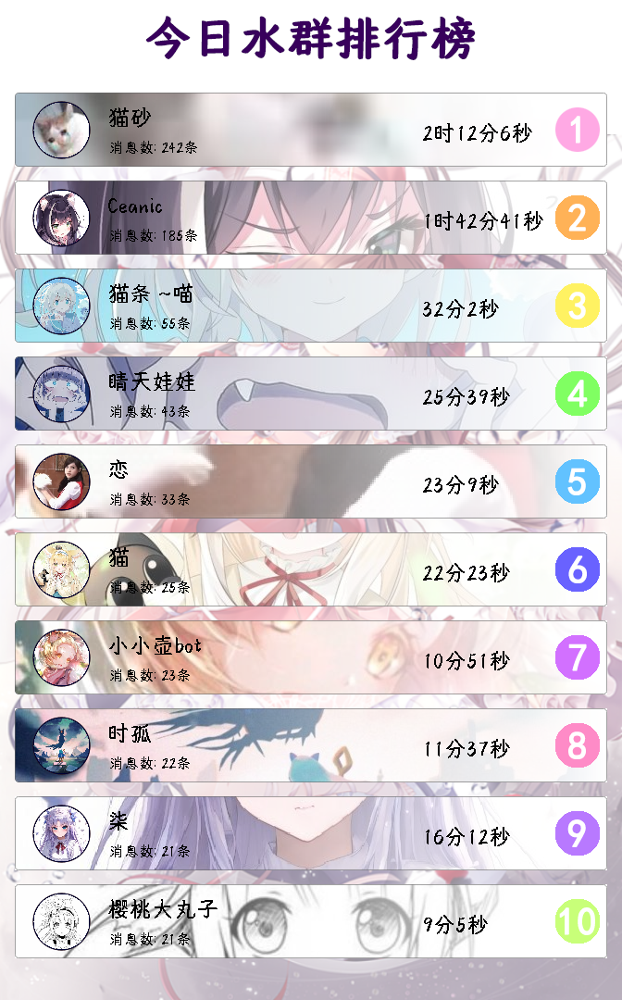
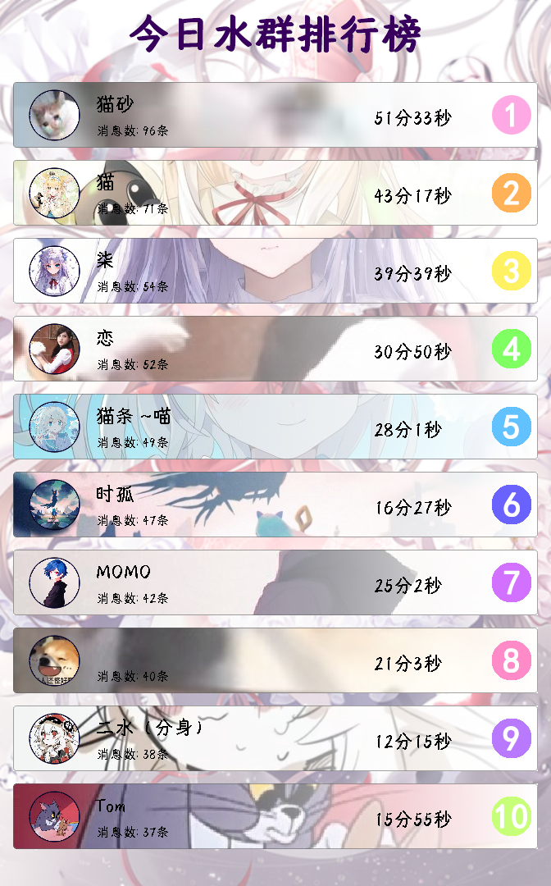

# 每日水群排行榜模块
本项目是用java2d写的一个每日排行榜图片制作模块。

## 有什么用
效果展示：

功能：

1.绘制群聊排行榜

## 如何使用本模块(开发者)

1.将代码下载到你的项目中

2.调用SendMsgCard.getCard()获取图片即可

## 如何使用本模块(非开发者)

实现本功能的Mirai插件见瑞丽斯

[by: 樱桃大丸子](https://github.com/BigCherryBall)